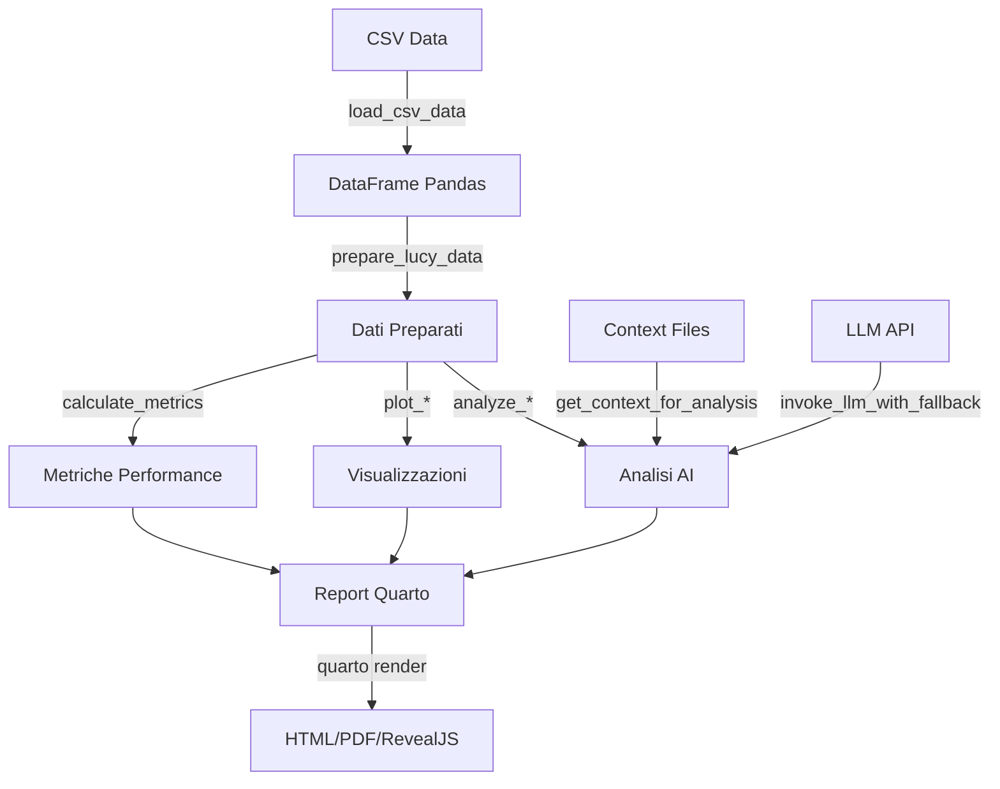
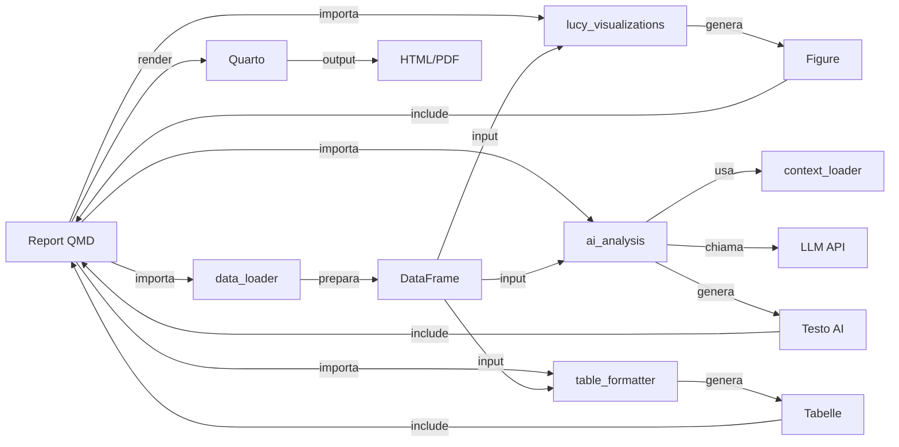

# Documentazione Funzionale - Sistema di Reportistica Automatica

## Panoramica Sistema

Il sistema di reportistica automatica è una piattaforma integrata che genera report analitici completi sui dati del sistema Lucy (applicativo documentale Luxottica). Il sistema combina:

- **Analisi dati automatica**: Caricamento, preparazione e calcolo metriche
- **Visualizzazioni**: Generazione automatica di grafici e analisi visive
- **Intelligenza Artificiale**: Integrazione con LLM per commenti analitici e insights
- **Reportistica multi-formato**: Generazione di report in HTML, PDF e presentazioni

### Obiettivo Funzionale

Il sistema analizza i dati di riconoscimento documentale (fatture) per:
- Valutare le performance dei metodi di riconoscimento (ML, Query-based, altri)
- Identificare pattern di errore e aree di miglioramento
- Fornire insights operativi attraverso analisi AI
- Generare report professionali pronti per la condivisione

## Flusso Dati End-to-End

Il sistema segue un flusso lineare che trasforma dati grezzi in report completi:



### Fasi del Processo

1. **Caricamento Dati** (`data_loader.py`)
   - Lettura file CSV
   - Rilevamento automatico dataset Lucy
   - Preparazione base (datetime, flags, categorizzazione)

2. **Preparazione Dati** (`data_loader.py`)
   - Conversione datetime
   - Creazione flag di validazione
   - Categorizzazione metodi (ML/Query/Other)
   - Calcolo metriche di performance

3. **Visualizzazione** (`lucy_visualizations.py`)
   - Generazione grafici metriche
   - Matrici di confusione
   - Timeline e distribuzioni
   - Heatmap geografiche

4. **Analisi AI** (`ai_analysis.py`)
   - Generazione commenti ai grafici
   - Analisi pattern di errore
   - Riassunti analitici
   - Raccomandazioni operative

5. **Formattazione** (`table_formatter.py`)
   - Conversione DataFrame in tabelle markdown
   - Formattazione statistiche

6. **Generazione Report** (`generate_report.py` + Quarto)
   - Orchestrazione rendering
   - Output multi-formato
   - Gestione errori e fallback

## Componenti Principali

### 1. Data Loader (`src/data_loader.py`)

**Responsabilità**: Caricamento e preparazione dati

**Funzionalità principali**:
- `load_csv_data()`: Carica dati da CSV con auto-rilevamento formato Lucy
- `prepare_lucy_data()`: Prepara dati Lucy (datetime, flags, categorizzazione)
- `calculate_metrics_by_method()`: Calcola precision, recall, F1, accuracy per metodo
- `calculate_metrics_by_field_and_method()`: Metriche aggregate per campo e metodo
- `filter_by_field_name()`: Filtra e prepara dati per campo specifico
- `get_field_names()`: Estrae lista campi disponibili
- `categorize_method()`: Classifica metodi in ML/Query/Other

**Input**: File CSV con dati Lucy
**Output**: DataFrame preparato con colonne aggiuntive e metriche

### 2. Visualizations (`src/lucy_visualizations.py`)

**Responsabilità**: Generazione grafici e visualizzazioni

**Funzionalità principali**:
- `plot_metrics_by_method()`: Barre metriche per metodo
- `plot_confusion_matrix_by_method()`: Matrice confusione per metodo
- `plot_confidence_distribution()`: Box plot distribuzione confidence
- `plot_timeline_predictions()`: Timeline predizioni nel tempo
- `plot_accuracy_heatmap()`: Heatmap accuracy per country e metodo
- `plot_ml_vs_query_comparison()`: Confronto ML vs Query
- `plot_method_usage()`: Distribuzione uso metodi
- `plot_field_name_distribution()`: Distribuzione campi

**Input**: DataFrame preparato
**Output**: Figure matplotlib pronte per rendering

### 3. AI Analysis (`src/ai_analysis.py`)

**Responsabilità**: Integrazione LLM per analisi e commenti

**Funzionalità principali**:
- `get_llm_with_fallback()`: Inizializza LLM con fallback automatico tra modelli
- `invoke_llm_with_fallback()`: Invoca LLM con timeout e fallback su errori
- `analyze_data_summary()`: Genera riassunto analitico dei dati
- `generate_chart_commentary()`: Genera commenti per grafici
- `analyze_error_patterns()`: Analizza pattern FP/FN
- `generate_section_text()`: Genera testo per sezioni report

**Caratteristiche**:
- Fallback automatico: gpt-5.2 → gpt-4o → gpt-4-turbo → gpt-4 → gemini-3-pro
- Timeout configurabile (default 60s) per evitare blocchi
- Integrazione contesto dominio dalla cartella `context/`
- Gestione errori robusta con messaggi informativi

**Input**: DataFrame, descrizioni grafici, contesto
**Output**: Testo analitico in markdown

### 4. Context Loader (`src/context_loader.py`)

**Responsabilità**: Caricamento e processazione file di contesto

**Funzionalità principali**:
- `load_context_files()`: Carica file PDF/Markdown dalla cartella context
- `get_context_for_analysis()`: Filtra contesto per tipo di analisi
- `extract_text_from_pdf()`: Estrae testo da PDF
- `find_relevant_sections()`: Trova sezioni rilevanti basate su keyword

**Input**: Cartella `context/` con file MD/PDF
**Output**: Testo formattato per prompt AI

### 5. Table Formatter (`src/table_formatter.py`)

**Responsabilità**: Formattazione tabelle per Quarto

**Funzionalità principali**:
- `format_table()`: Converte DataFrame in markdown
- `format_summary_dict()`: Formatta dizionari statistiche
- `display_table()`: Visualizzazione diretta

**Input**: DataFrame o dizionario
**Output**: Markdown formattato per Quarto

### 6. Report Generator (`scripts/generate_report.py`)

**Responsabilità**: Orchestrazione generazione report

**Funzionalità principali**:
- `render_quarto_report()`: Esegue rendering Quarto in formati multipli
- Gestione errori e validazione input
- Supporto formati: HTML, PDF, RevealJS

**Input**: File `.qmd`, formato output
**Output**: File HTML/PDF/RevealJS generati

## Interazioni tra Componenti



## Funzionalità per Modulo

### Data Loader - Dettaglio Funzionale

**Cosa fa**:
1. Carica dati CSV e rileva automaticamente se sono dati Lucy
2. Prepara dati base: converte datetime, crea flag `is_validated`, categorizza metodi
3. Calcola metriche di performance (precision, recall, F1, accuracy) da confusion matrix
4. Supporta filtraggio per campo specifico mantenendo preparazione completa

**Come interagisce**:
- Input per tutte le visualizzazioni
- Base per calcolo metriche usate in analisi AI
- Fornisce dati aggregati per report

### Visualizations - Dettaglio Funzionale

**Cosa fa**:
1. Genera grafici standardizzati con stile consistente
2. Crea visualizzazioni specifiche per analisi Lucy (confusion matrix, heatmap geografiche)
3. Supporta dimensioni personalizzabili ma con default ottimizzati

**Come interagisce**:
- Usa DataFrame preparati da data_loader
- Output figure integrate direttamente in report Quarto
- Grafici referenziati in analisi AI per commenti

### AI Analysis - Dettaglio Funzionale

**Cosa fa**:
1. Inizializza connessioni LLM con fallback automatico tra modelli
2. Gestisce timeout per evitare blocchi (60s default)
3. Carica contesto dominio per migliorare qualità analisi
4. Genera testo analitico strutturato in markdown

**Come interagisce**:
- Usa context_loader per contesto dominio
- Riceve dati/grafici da altri moduli
- Output testo integrato in report
- Gestisce errori gracefully (messaggi informativi invece di crash)

### Context Loader - Dettaglio Funzionale

**Cosa fa**:
1. Scansiona cartella `context/` per file MD/PDF
2. Estrae testo e divide in sezioni
3. Filtra sezioni rilevanti basate su keyword
4. Formatta contesto per inclusion in prompt AI

**Come interagisce**:
- Chiamato da ai_analysis per contesto specifico
- Migliora qualità analisi AI con conoscenza dominio
- Supporta file dinamici (possono essere aggiunti/modificati)

## Flusso di Esecuzione Report

### 1. Inizializzazione
- Quarto carica file `.qmd`
- Python importa moduli da `src/`
- Sistema verifica disponibilità API keys

### 2. Caricamento Dati
```python
df = load_csv_data("data/lucy_data.csv")
# → DataFrame con colonne base
# → Auto-preparazione se rilevato formato Lucy
```

### 3. Preparazione
```python
df = prepare_lucy_data(df)
# → Aggiunge: date, hour, day_of_week, is_validated, method_type
```

### 4. Calcolo Metriche
```python
metrics = calculate_metrics_by_method(df)
# → DataFrame con precision, recall, F1, accuracy per metodo
```

### 5. Visualizzazioni
```python
fig = plot_metrics_by_method(metrics)
# → Figure matplotlib pronta per rendering
```

### 6. Analisi AI (se abilitata)
```python
commentary = generate_chart_commentary(description, data_summary)
# → Testo markdown con analisi e raccomandazioni
```

### 7. Formattazione Tabelle
```python
table = format_table(metrics, caption="Metriche Performance")
# → Markdown formattato per Quarto
```

### 8. Rendering Finale
- Quarto compila tutto in HTML/PDF
- Include grafici, tabelle, testo AI
- Applica stili e formattazione

## Gestione Errori e Robustezza

### Fallback LLM
- Se modello primario fallisce (quota/timeout), prova automaticamente modelli alternativi
- Ordine: gpt-5.2 → gpt-4o → gpt-4-turbo → gpt-4 → gemini-3-pro
- Se tutti falliscono, restituisce messaggio informativo invece di crash

### Timeout API
- Tutte le chiamate LLM hanno timeout (60s default, configurabile)
- Evita blocchi indefiniti
- Messaggi di warning su stderr

### Gestione Dati Mancanti
- Funzioni gestiscono DataFrame vuoti gracefully
- Messaggi informativi invece di errori
- Supporto colonne opzionali (es. field_name)

### Validazione Input
- Verifica esistenza file prima di rendering
- Controllo formati supportati
- Messaggi di errore chiari e informativi

## Configurazione e Personalizzazione

### Variabili d'Ambiente
- `OPENAI_API_KEY`: API key OpenAI (richiesta per AI)
- `GOOGLE_API_KEY`: API key Google (opzionale, per Gemini fallback)
- `LLM_API_TIMEOUT`: Timeout chiamate API in secondi (default: 60)

### Parametri Report
- `dataset_path`: Percorso file CSV dati
- `enable_ai`: Abilita/disabilita analisi AI (true/false)

### Personalizzazione
- File `context/`: Aggiungi file MD/PDF per migliorare contesto AI
- `styles.css`: Personalizza stile report
- `_quarto.yml`: Configurazione globale Quarto

## Output del Sistema

### Report HTML
- Interattivo, navigabile
- Grafici interattivi
- Tabelle formattate
- Commenti AI formattati in markdown

### Report PDF
- Pronto per stampa/condivisione
- Grafici ad alta risoluzione (300 DPI)
- Layout ottimizzato per pagina
- Tabelle e testo formattati

### Report RevealJS
- Presentazione interattiva
- Slide navigabili
- Ideale per presentazioni

## Estendibilità

Il sistema è progettato per essere estendibile:

- **Nuovi grafici**: Aggiungi funzioni in `lucy_visualizations.py`
- **Nuove analisi AI**: Aggiungi funzioni in `ai_analysis.py`
- **Nuovi formati dati**: Estendi `data_loader.py` con nuovi preparatori
- **Nuovi report**: Crea nuovi file `.qmd` usando moduli esistenti

## Note Operative

- Il sistema supporta dataset dinamici (può cambiare nel tempo)
- Le analisi AI richiedono API key valida
- I report possono essere generati senza AI (con `enable_ai: false`)
- Il sistema gestisce automaticamente fallback e timeout
- I file di contesto possono essere aggiornati senza modificare codice

